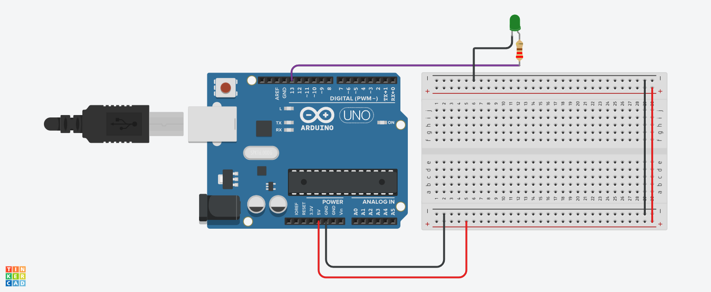

# 💡 LED Blinking System using Arduino

## 📌 Project Overview
This is a basic Arduino project where an LED blinks ON and OFF continuously with a fixed time interval.

It is one of the simplest projects to understand digital output and timing control in Arduino.

---

## 🔧 Components Used
- Arduino Uno  
- LED  
- Resistor  
- Jumper Wires  

---

## 🔌 Pin Configuration

| Component | Arduino Pin | Type   |
|----------|------------|--------|
| LED      | 13         | Output |

---

## 📸 Circuit Design & Simulation

Here is the full circuit architecture designed in **Tinkercad**:

---

## ⚙️ Working Principle

### 🔹 Output
The Arduino turns the LED ON and OFF repeatedly using digital signals.

- HIGH → LED ON  
- LOW → LED OFF  

### 🔹 Timing Control
A delay is used to control how long the LED stays ON or OFF.

---

## 🧠 Important Functions

### 🔹 pinMode()
Sets pin 13 as OUTPUT.

### 🔹 digitalWrite()
Controls LED state (ON/OFF).

### 🔹 delay()
Pauses execution for a specific time (milliseconds).

---

## 🔄 System Flow

1. Set pin 13 as output  
2. Turn LED ON  
3. Wait for 1 second  
4. Turn LED OFF  
5. Wait for 1 second  
6. Repeat continuously  

---

## ⏱️ Timing Logic

delay(1000) = 1 second

- LED ON for 1 second  
- LED OFF for 1 second  

---

## ⚠️ Improvements

- Change blinking speed:

delay(500); // faster blinking

- Use multiple LEDs for patterns  
- Use button input to control blinking  

---

## 🎯 Key Learning Points

- Digital output control  
- Basic Arduino structure (setup & loop)  
- Timing using delay()  
- Hardware interfacing basics  

---

## ✅ Conclusion
This project demonstrates the fundamental concept of controlling an output device (LED) using Arduino, which is the foundation for more advanced embedded systems.