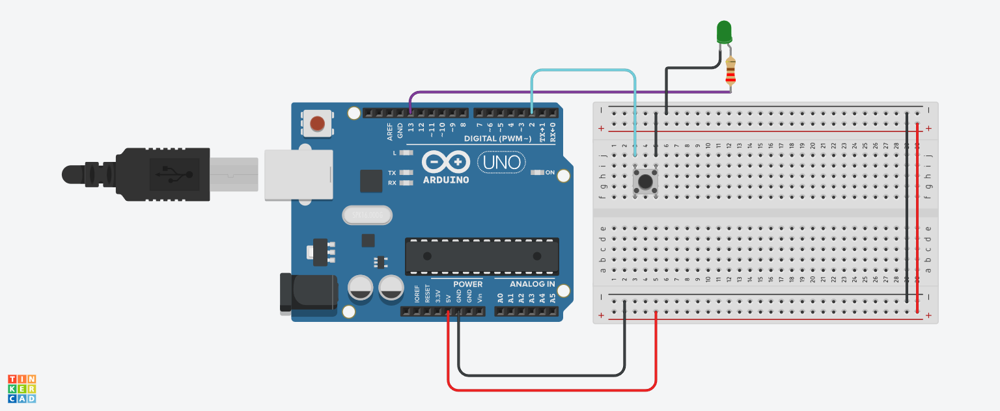

# 🔘 Push Button Controlled LED (Using INPUT_PULLUP)

## 📌 Project Overview
This project controls an LED using a push button.  
When the button is pressed, the LED turns ON. When released, the LED turns OFF.

It demonstrates the use of internal pull-up resistor in Arduino.

---

## 🔧 Components Used
- Arduino Uno  
- Push Button  
- LED  
- Resistor (for LED)  
- Jumper Wires  

---

## 🔌 Pin Configuration

| Component   | Arduino Pin | Type   |
|------------|------------|--------|
| Button     | 2          | Input  |
| LED        | 13         | Output |

---

## 📸 Circuit Design & Simulation

Here is the full circuit architecture designed in **Tinkercad**:

---

## ⚙️ Working Principle

### 🔹 Input (Button with INPUT_PULLUP)
- Button uses Arduino’s **internal pull-up resistor**
- Default state → HIGH  
- When pressed → LOW  

👉 So logic is reversed:
- Pressed = LOW  
- Not Pressed = HIGH  

### 🔹 Output (LED)
- Button pressed → LED ON  
- Button released → LED OFF  

---

## 🧠 Important Functions

### 🔹 pinMode(INPUT_PULLUP)
Enables internal pull-up resistor (no external resistor needed).

### 🔹 digitalRead()
Reads button state (HIGH or LOW).

### 🔹 digitalWrite()
Controls LED ON/OFF.

---

## 🔄 System Flow

1. Set button as INPUT_PULLUP  
2. Read button state  
3. If button is pressed (LOW)  
4. Turn LED ON  
5. Else → Turn LED OFF  
6. Repeat continuously  

---

## ⚠️ Key Logic Explanation

if (digitalRead(buttonPin) == LOW)

- LOW means button is pressed  
- Because INPUT_PULLUP reverses normal logic  

---

## ⚠️ Improvements

- Add debounce logic to avoid noise  
- Use Serial Monitor to debug input  
- Control multiple LEDs with one button  

---

## 🎯 Key Learning Points

- INPUT_PULLUP concept  
- Digital input reading  
- Button handling logic  
- Real-world input control system  

---

## ✅ Conclusion
This project shows how user input (button press) can control an output device (LED), forming the basis of interactive embedded systems.