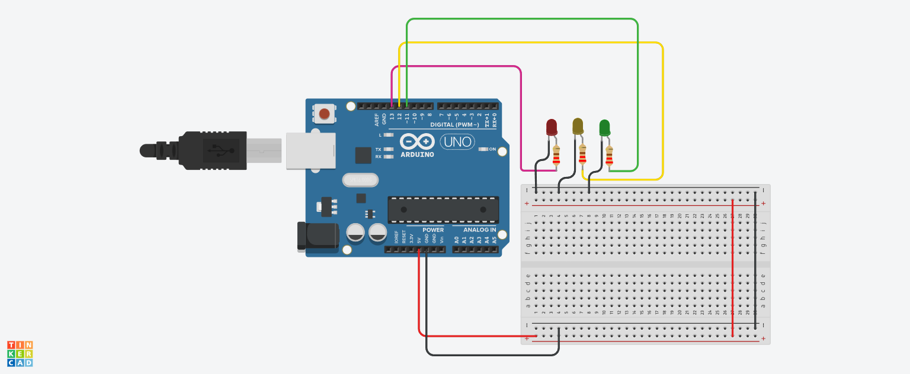

# 🚦 Traffic Light Control System using Arduino

## 📌 Project Overview
This project simulates a real-world traffic light system using three LEDs:
- 🔴 Red → Stop  
- 🟡 Yellow → Wait  
- 🟢 Green → Go  

The LEDs turn ON and OFF in a fixed sequence with specific timing delays.

---

## 🔧 Components Used
- Arduino Uno  
- 3 LEDs (Red, Yellow, Green)  
- Resistors  
- Jumper Wires  

---

## 🔌 Pin Configuration

| Component   | Arduino Pin | Type   |
|------------|------------|--------|
| Red LED    | 13         | Output |
| Yellow LED | 12         | Output |
| Green LED  | 11         | Output |

---

## 📸 Circuit Design & Simulation

Here is the full circuit architecture designed in **Tinkercad**:

---

## ⚙️ Working Principle

### 🔹 Output Sequence
The system follows a continuous loop of traffic signals:

1. 🔴 Red ON → Stop (5 seconds)  
2. 🟡 Yellow ON → Wait (2 seconds)  
3. 🟢 Green ON → Go (5 seconds)  

Then the cycle repeats.

---

## 🧠 Important Functions

### 🔹 pinMode()
Sets LED pins as OUTPUT.

### 🔹 digitalWrite()
Controls which LED is ON or OFF.

### 🔹 delay()
Controls how long each light stays ON.

---

## 🔄 System Flow

1. Turn ON Red LED  
2. Wait 5 seconds  
3. Turn ON Yellow LED  
4. Wait 2 seconds  
5. Turn ON Green LED  
6. Wait 5 seconds  
7. Repeat cycle  

---

## ⏱️ Timing Logic

Red Light → delay(5000) = 5 seconds
Yellow Light → delay(2000) = 2 seconds
Green Light → delay(5000) = 5 seconds

---

## ⚠️ Improvements

- Add pedestrian button control  
- Use buzzer for crossing signal  
- Implement smart traffic system using sensors  
- Use millis() instead of delay() for non-blocking control  

---

## 🎯 Key Learning Points

- Sequential control of multiple outputs  
- Timing and delay management  
- Real-world system simulation  
- Embedded system design basics  

---

## ✅ Conclusion
This project demonstrates how a traffic light system works using Arduino, helping to understand timing control and sequential logic in embedded systems.