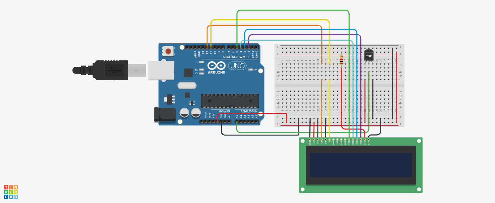

# 🌡️ LCD Temperature Display System (Arduino + Analog Sensor)

## 📌 Project Overview
This project reads temperature from an analog sensor and displays it on a 16x2 LCD screen in real-time.

It is a simple temperature monitoring system with direct visual output (no Serial Monitor needed).

---

## 🔧 Components Used
- Arduino Uno  
- 16x2 LCD Display  
- Temperature Sensor (TMP36 / LM35)  
- Jumper Wires  
- Potentiometer (for LCD contrast - optional)  

---

## 🔌 Pin Configuration

### 📟 LCD Connection

| LCD Pin | Arduino Pin |
|--------|------------|
| RS     | 12         |
| E      | 11         |
| D4     | 5          |
| D5     | 4          |
| D6     | 3          |
| D7     | 2          |

### 🌡️ Sensor

| Component           | Arduino Pin | Type  |
|--------------------|------------|-------|
| Temperature Sensor | A0         | Input |

---

## 📸 Circuit Design & Simulation

Here is the full circuit architecture designed in **Tinkercad**:

---

## ⚙️ Working Principle

### 🔹 Input
Temperature sensor sends an analog signal based on temperature.

### 🔹 Processing
Arduino converts analog reading → voltage → temperature using:

voltage = reading × (5.0 / 1023.0)
temperature (°C) = (voltage - 0.5) × 100

- `5.0` = reference voltage  
- `1023` = ADC resolution  
- `0.5` = offset (TMP36 sensor)  

### 🔹 Output
- LCD displays temperature in Celsius  
- Updates every 1 second  

---

## 🧠 Important Functions

### 🔹 LiquidCrystal lcd(...)
Initializes LCD with Arduino pin connections.

### 🔹 lcd.begin(16, 2)
Sets LCD size (16 columns, 2 rows).

### 🔹 analogRead()
Reads analog sensor value.

### 🔹 lcd.setCursor(col, row)
Sets cursor position on LCD.

### 🔹 lcd.print()
Displays text/data on LCD.

### 🔹 delay()
Controls refresh rate.

---

## 🔄 System Flow

1. Read analog value from sensor  
2. Convert reading → voltage  
3. Convert voltage → temperature  
4. Set LCD cursor position  
5. Display temperature on LCD  
6. Wait 1 second and repeat  

---

## ⚠️ Improvements

- Limit decimal places:

lcd.print(tempC, 1);

- Add unit symbol clearly:

lcd.print(" C");

- Add warning system (LED/Buzzer) for high temperature  

---

## 🎯 Key Learning Points

- LCD interfacing with Arduino  
- Analog to digital conversion (ADC)  
- Real-time data display  
- Sensor-based monitoring system  
- Embedded system basics  

---

## ✅ Conclusion
This project demonstrates how sensor data can be directly visualized using an LCD, making it suseful for real-time monitoring systems without requiring a computer.