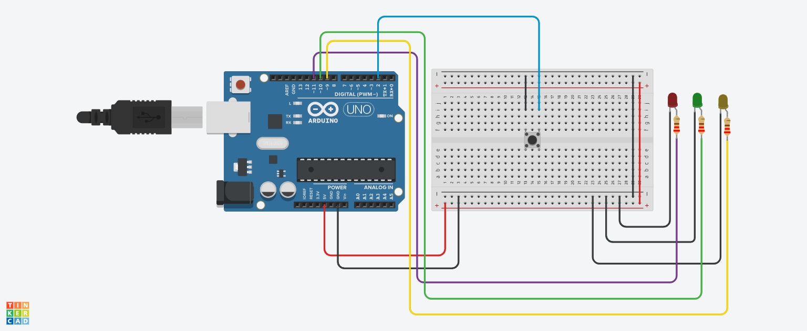

# 🔘 Three LED with Push Button (Arduino)

## 📌 Project Overview
This project controls three LEDs using a push button.  
When the button is pressed, the LEDs turn ON one by one with a delay.  
When the button is released, all LEDs turn OFF.

It demonstrates basic input handling and sequential output control.

---

## 🔧 Components Used
- Arduino Uno  
- 3 LEDs (Red, Green, Yellow)  
- Push Button  
- Resistors  
- Jumper Wires  

---

## 🔌 Pin Configuration

| Component   | Arduino Pin | Type   |
|------------|------------|--------|
| Red LED    | 11         | Output |
| Green LED  | 10         | Output |
| Yellow LED | 9          | Output |
| Button     | 2          | Input  |

---
## 📸 Circuit Design & Simulation

Here is the full circuit architecture designed in **Tinkercad**:

---
## ⚙️ Working Principle

### 🔹 Input (Push Button)
- Button uses **INPUT_PULLUP**
- Default state → HIGH  
- Pressed → LOW  

### 🔹 Output (LEDs)
- Button Pressed → LEDs turn ON sequentially  
- Button Released → All LEDs turn OFF  

---

## 🧠 Important Functions

### 🔹 pinMode(INPUT_PULLUP)
Enables internal pull-up resistor for button.

### 🔹 digitalRead()
Reads button state.

### 🔹 digitalWrite()
Controls LED ON/OFF.

### 🔹 delay()
Creates delay between LED activation.

---

## 🔄 System Flow

1. Read button state  
2. If button is pressed (LOW):  
   - Turn ON Red LED  
   - Wait 1 second  
   - Turn ON Green LED  
   - Wait 1 second  
   - Turn ON Yellow LED  
3. If button is not pressed:  
   - Turn OFF all LEDs  
4. Repeat continuously  

---

## ⏱️ Timing Logic

delay(1000) = 1 second

- LEDs turn ON step-by-step with 1 second delay  

---

## ⚠️ Improvements

- Turn LEDs OFF before turning next ON (for cleaner sequence)  
- Use `millis()` instead of delay for better control  
- Add reverse sequence (ON → OFF animation)  
- Add buzzer for feedback  

---

## 🎯 Key Learning Points

- Button input handling (INPUT_PULLUP)  
- Sequential control of multiple outputs  
- Timing using delay()  
- Interactive embedded system design  

---

## ✅ Conclusion
This project demonstrates how a push button can control multiple LEDs in a sequence, helping to understand user input and timed output behavior in Arduino systems.