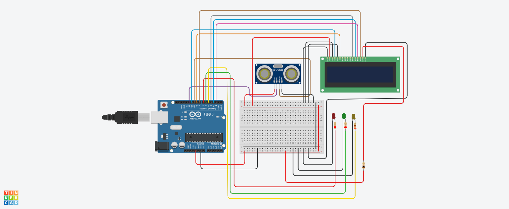

# 🚦 Smart Distance Monitoring System with LCD (Arduino)

## 📌 Project Overview
This project combines an ultrasonic sensor, LCD display, and LEDs to create a smart distance monitoring system.

- 📏 Measures distance using ultrasonic sensor  
- 📟 Displays distance on LCD  
- 🚦 Uses LEDs to indicate status:
  - 🔴 Red → Stop (very close)  
  - 🟢 Green → Go (safe distance)  
  - 🟡 Yellow → Wait (medium distance)  

It simulates a real-world smart alert system like parking assist or obstacle detection.

---

## 🔧 Components Used
- Arduino Uno  
- Ultrasonic Sensor (HC-SR04)  
- 16x2 LCD Display  
- 3 LEDs (Red, Green, Yellow)  
- Resistors  
- Jumper Wires  

---

## 🔌 Pin Configuration

### 📟 LCD Connection

| LCD Pin | Arduino Pin |
|--------|------------|
| RS     | 11         |
| E      | 9          |
| D4     | 4          |
| D5     | 3          |
| D6     | 2          |
| D7     | 8          |

### 🌡️ Ultrasonic Sensor

| Component | Arduino Pin | Type   |
|----------|------------|--------|
| Trig     | 12         | Output |
| Echo     | 10         | Input  |

### 💡 LEDs

| Component   | Arduino Pin | Type   |
|------------|------------|--------|
| Red LED    | 7          | Output |
| Green LED  | 6          | Output |
| Yellow LED | 5          | Output |

---
## 📸 Circuit Design & Simulation

Here is the full circuit architecture designed in **Tinkercad**:

---
## ⚙️ Working Principle

### 🔹 Input (Ultrasonic Sensor)
- Sends ultrasonic pulse from **Trig**
- Receives echo on **Echo**
- Measures time taken

### 🔹 Processing
Distance is calculated using:

distance = duration × 0.034 / 2

- 0.034 = speed of sound (cm/µs)  
- Divided by 2 (forward + return path)  

A custom function `getDistance()` handles this calculation.

### 🔹 Output

#### 📟 LCD Display
- Shows real-time distance  
- Displays system status (STOP / GO / WAIT)

#### 🚦 LED Indicators

| Distance Range | LED Status        | Meaning |
|---------------|------------------|---------|
| < 20 cm       | 🔴 Red ON        | Stop    |
| 20–50 cm      | 🟢 Green ON      | Safe    |
| > 50 cm       | 🟡 Yellow ON     | Wait    |

---

## 🧠 Important Functions

### 🔹 getDistance()
Custom function to:
- Send ultrasonic signal  
- Measure echo time  
- Return calculated distance  

### 🔹 pulseIn()
Measures duration of echo signal.

### 🔹 lcd.begin()
Initializes LCD display.

### 🔹 lcd.setCursor()
Sets cursor position on LCD.

### 🔹 lcd.print()
Displays text/data.

### 🔹 Serial.println()
Prints distance for debugging.

---

## 🔄 System Flow

1. Initialize LCD and show "System Ready"  
2. Trigger ultrasonic pulse  
3. Measure echo duration  
4. Convert duration → distance  
5. Display distance on LCD  
6. Check distance range  
7. Turn ON corresponding LED  
8. Display status message on LCD  
9. Repeat continuously  

---

## ⚠️ Improvements

- Clear second line before printing new text:

lcd.print(" ");

- Add buzzer for sound alert  
- Use `millis()` instead of delay for smoother system  
- Add obstacle threshold customization  

---

## 🎯 Key Learning Points

- Function-based modular programming  
- Ultrasonic sensor integration  
- LCD interfacing  
- Multi-output control (LED + Display)  
- Real-time embedded system design  

---

## ✅ Conclusion
This project demonstrates a complete smart monitoring system where sensor data is processed and displayed visually while also providing real-time alerts using LEDs, making it highly useful for practical applications like parking systems and safety monitoring.