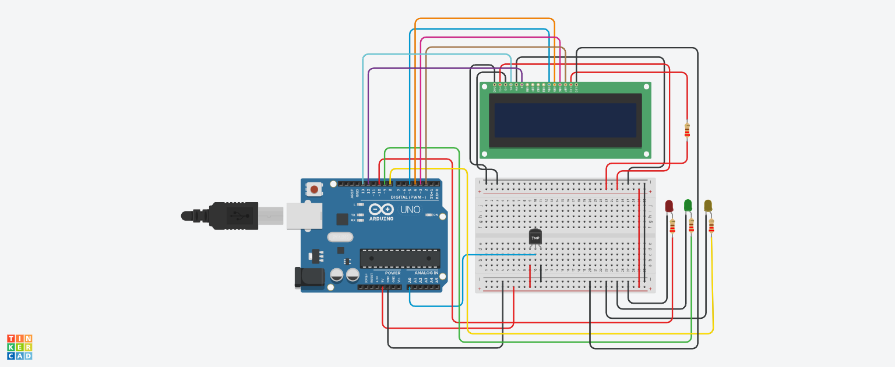

# 🌡️ Smart Temperature Monitoring System with LCD & LED Indicators (Arduino)

## 📌 Project Overview
This project measures temperature using an analog sensor and displays it on a 16x2 LCD.  
It also uses LEDs to indicate temperature conditions:

- 🟡 Yellow → Too Cold  
- 🟢 Green → Moderate Temperature  
- 🔴 Red → Extreme Heat  

It simulates a real-time environmental monitoring system.

---

## 🔧 Components Used
- Arduino Uno  
- Temperature Sensor (TMP36 / LM35)  
- 16x2 LCD Display  
- 3 LEDs (Red, Green, Yellow)  
- Resistors  
- Jumper Wires  

---

## 🔌 Pin Configuration

### 📟 LCD Connection

| LCD Pin | Arduino Pin |
|--------|------------|
| RS     | 13         |
| E      | 12         |
| D4     | 5          |
| D5     | 4          |
| D6     | 3          |
| D7     | 2          |

### 🌡️ Sensor

| Component           | Arduino Pin | Type  |
|--------------------|------------|-------|
| Temperature Sensor | A0         | Input |

### 💡 LEDs

| Component   | Arduino Pin | Type   |
|------------|------------|--------|
| Red LED    | 10         | Output |
| Green LED  | 9          | Output |
| Yellow LED | 8          | Output |

---
## 📸 Circuit Design & Simulation

Here is the full circuit architecture designed in **Tinkercad**:

---
## ⚙️ Working Principle

### 🔹 Input
Temperature sensor sends an analog signal based on temperature.

### 🔹 Processing
Temperature is calculated using:

voltage = analog_read × 5 / 1024
temperature (°C) = 100 × (voltage - 0.5)

- `5V` = reference voltage  
- `1024` = ADC resolution  
- `0.5` = offset (TMP36 sensor)  

A custom function `Temp()` handles the calculation.

### 🔹 Output

#### 📟 LCD Display
- Shows real-time temperature  
- Displays condition message  

#### 💡 LED Indicators

| Temperature Range | LED Status     | Meaning          |
|------------------|---------------|------------------|
| < 20°C           | 🟡 Yellow ON  | Too Cold         |
| 20–40°C          | 🟢 Green ON   | Moderate Temp    |
| > 40°C           | 🔴 Red ON     | Extreme Heat     |

---

## 🧠 Important Functions

### 🔹 Temp()
Custom function to:
- Read analog value  
- Convert to voltage  
- Convert to temperature  

### 🔹 analogRead()
Reads sensor data.

### 🔹 lcd.begin()
Initializes LCD.

### 🔹 lcd.setCursor()
Sets cursor position.

### 🔹 lcd.print()
Displays text/data.

### 🔹 digitalWrite()
Controls LED indicators.

---

## 🔄 System Flow

1. Initialize LCD and show "System is ready"  
2. Read analog value from sensor  
3. Convert value → voltage → temperature  
4. Display temperature on LCD  
5. Check temperature range  
6. Turn ON corresponding LED  
7. Show condition message on LCD  
8. Repeat continuously  

---

## ⚠️ Improvements

- Fix condition ranges:

Temperature >= 20 && Temperature <= 40

- Clear LCD line before updating:

lcd.print(" ");

- Limit decimal places:

lcd.print(Temperature, 1);

- Add buzzer for alert system  

---

## 🎯 Key Learning Points

- Analog sensor data processing  
- LCD interfacing  
- Multi-condition logic handling  
- Real-time monitoring system  
- Embedded system design  

---

## ✅ Conclusion
This project demonstrates a complete temperature monitoring system where sensor data is processed, displayed on an LCD, and visually indicated using LEDs, making it useful for real-world environmental monitoring applications.