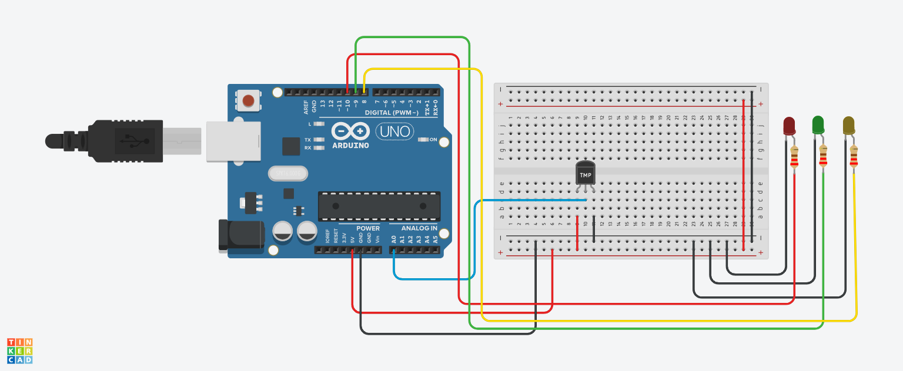

# 🌡️ Temperature Indicator System using LEDs (Arduino)

## 📌 Project Overview
This project measures temperature using an analog sensor and indicates the condition using three LEDs.

- 🟡 Yellow → Too Cold  
- 🟢 Green → Moderate Temperature  
- 🔴 Red → Extreme Heat  

It is a simple real-time temperature monitoring system without LCD.

---

## 🔧 Components Used
- Arduino Uno  
- Temperature Sensor (TMP36 / LM35)  
- 3 LEDs (Red, Green, Yellow)  
- Resistors  
- Jumper Wires  

---

## 🔌 Pin Configuration

### 🌡️ Sensor

| Component           | Arduino Pin | Type  |
|--------------------|------------|-------|
| Temperature Sensor | A0         | Input |

### 💡 LEDs

| Component   | Arduino Pin | Type   |
|------------|------------|--------|
| Red LED    | 10         | Output |
| Green LED  | 9          | Output |
| Yellow LED | 8          | Output |

---
## 📸 Circuit Design & Simulation

Here is the full circuit architecture designed in **Tinkercad**:

---
## ⚙️ Working Principle

### 🔹 Input
Temperature sensor provides an analog signal based on temperature.

### 🔹 Processing
Temperature is calculated using:

voltage = analog_read × 5 / 1024
temperature (°C) = 100 × (voltage - 0.5)

- `5V` = reference voltage  
- `1024` = ADC resolution  
- `0.5` = offset (TMP36 sensor)  

A custom function `Temp()` performs this calculation.

### 🔹 Output (LED Indication)

| Temperature Range | LED Status     | Meaning          |
|------------------|---------------|------------------|
| < 20°C           | 🟡 Yellow ON  | Too Cold         |
| 20–40°C          | 🟢 Green ON   | Moderate Temp    |
| > 40°C           | 🔴 Red ON     | Extreme Heat     |

---

## 🧠 Important Functions

### 🔹 Temp()
Custom function to:
- Read analog value  
- Convert to voltage  
- Convert to temperature  

### 🔹 analogRead()
Reads sensor value.

### 🔹 Serial.println()
Prints temperature in Serial Monitor.

### 🔹 digitalWrite()
Controls LED indicators.

---

## 🔄 System Flow

1. Read analog value from sensor  
2. Convert value → voltage → temperature  
3. Print temperature in Serial Monitor  
4. Check temperature range  
5. Turn ON corresponding LED  
6. Repeat continuously  

---

## ⚠️ Improvements

- Fix condition:

Temperature >= 20 && Temperature <= 40

- Use float precision:

voltage = analog_read * 5.0 / 1024.0;

- Add LCD display for better visualization  
- Add buzzer for alert system  

---

## 🎯 Key Learning Points

- Analog sensor data processing  
- Temperature calculation  
- Multi-condition LED control  
- Serial monitoring  
- Embedded system basics  

---

## ✅ Conclusion
This project demonstrates how temperature data can be processed and visually represented using LEDs, forming a simple but effective monitoring system.