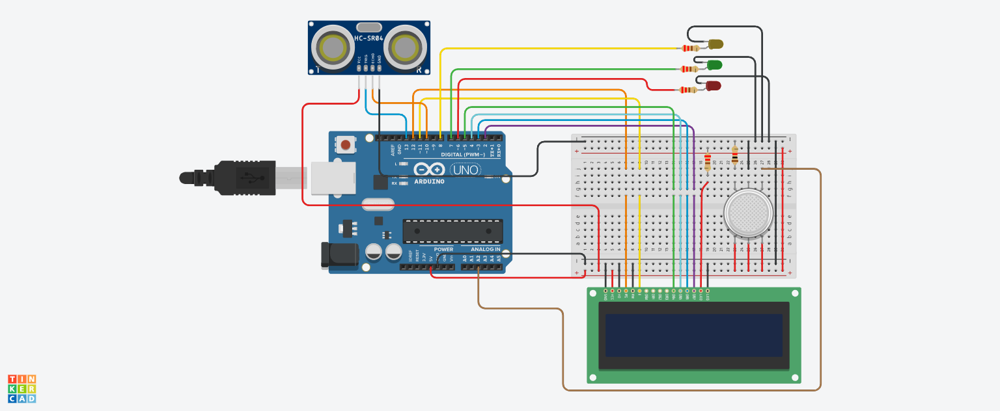

# 🚨 Smart Safety Monitoring System (Gas + Distance + LCD + LEDs)

## 📌 Project Overview
This project is a multi-sensor safety monitoring system that combines:

- 🌫️ Gas Detection (Analog Sensor)  
- 📏 Distance Measurement (Ultrasonic Sensor)  
- 📟 LCD Display (Real-time Data)  
- 🚦 LED Indicators (Status Alert)  

The system continuously monitors gas levels and distance, then decides safety status using conditional logic.

---

## 🔧 Components Used
- Arduino Uno  
- Ultrasonic Sensor (HC-SR04)  
- Gas Sensor (MQ-2 or similar)  
- 16x2 LCD Display  
- 3 LEDs (Red, Green, Yellow)  
- Resistors  
- Jumper Wires  

---

## 🔌 Pin Configuration

### 📟 LCD Connection

| LCD Pin | Arduino Pin |
|--------|------------|
| RS     | 12         |
| E      | 11         |
| D4     | 5          |
| D5     | 4          |
| D6     | 3          |
| D7     | 2          |

### 🌫️ Gas Sensor

| Component | Arduino Pin | Type  |
|----------|------------|-------|
| Gas      | A2         | Input |

### 📏 Ultrasonic Sensor

| Component | Arduino Pin | Type   |
|----------|------------|--------|
| Trig     | 13         | Output |
| Echo     | 10         | Input  |

### 💡 LEDs

| Component   | Arduino Pin | Type   |
|------------|------------|--------|
| Red LED    | 6          | Output |
| Green LED  | 7          | Output |
| Yellow LED | 8          | Output |

---
## 📸 Circuit Design & Simulation

Here is the full circuit architecture designed in **Tinkercad**:

---
## ⚙️ Working Principle

### 🔹 Input
- Gas sensor provides analog value based on gas concentration  
- Ultrasonic sensor measures distance using sound waves  

### 🔹 Processing

#### 📏 Distance Formula

distance = duration × 0.034 / 2

#### 🌫️ Gas Value
- Direct analog value from sensor (0–1023)  

### 🔹 Output

#### 📟 LCD Display
- Shows real-time gas value and distance:

G:<gas_value> D:<distance>

#### 🚦 LED Indicators Logic

| Condition                              | LED Status        | Meaning            |
|----------------------------------------|------------------|--------------------|
| Gas ≤ 25 AND Distance > 20             | 🟢 Green ON      | Safe               |
| Gas 26–30 OR Distance 10–20            | 🟡 Yellow ON     | Warning            |
| Gas > 80 AND Distance ≥ 10             | 🔴 Red ON        | High Gas Danger    |
| Gas > 30 AND Distance < 10             | 🔴 Red Blinking  | Critical Danger    |
| Else                                   | All OFF          | Idle / No Data     |

---

## 🧠 Important Functions

### 🔹 getD()
Custom function to:
- Trigger ultrasonic signal  
- Measure echo duration  
- Return calculated distance  

### 🔹 analogRead()
Reads gas sensor value.

### 🔹 pulseIn()
Measures echo duration.

### 🔹 lcd.begin()
Initializes LCD.

### 🔹 lcd.setCursor()
Sets cursor position.

### 🔹 lcd.print()
Displays sensor data.

### 🔹 digitalWrite()
Controls LED indicators.

---

## 🔄 System Flow

1. Initialize LCD and display "System ON"  
2. Read gas sensor value  
3. Measure distance using ultrasonic sensor  
4. Display gas and distance on LCD  
5. Apply condition-based logic  
6. Turn ON corresponding LED  
7. Repeat continuously  

---

## ⚠️ Improvements

- Add buzzer for sound alert in danger state  
- Clear LCD line before updating:

lcd.print(" ");

- Optimize condition ranges to avoid overlap  
- Use threshold calibration for gas sensor  

---

## 🎯 Key Learning Points

- Multi-sensor integration  
- Function-based modular programming  
- Real-time monitoring system  
- Complex conditional logic handling  
- LCD interfacing + data display  

---

## ✅ Conclusion
This project demonstrates a complete smart safety system where multiple sensor inputs are processed to make real-time decisions and provide alerts using LEDs and LCD display. It reflects practical embedded system design and real-world application readiness.